### Automatic Product Recommender

⭐⭐⭐⭐⭐ Automatic Product Recommender **(APR)** is an Artificial Intelligence API for recommending products based on customer reviews. 👍👎


### Abstract

Automatic Product Recommender **(APR)** is a very useful topic in modern technologies. In this repository I present an **APR** graphql API served locally for recommending products based on other customer's reviews. APR is very useful in modern technology because it helps product consumers to chose weather they should buy the product or not based on previous experience customer reviews.

### Folder structure

The folder structure of the server looks as follows:

```
C:.
├───app
│   └───__pycache__
├───model
│   └───static
├───resolvers
│   ├───mutations
│   └───queries
│       └───__pycache__
└───utils
    └───__pycache__
```

### Data.

The dataset that was used in this project was obtained from public datasets from [Kaggle.com](https://www.kaggle.com/) and the dataset name was [womens-ecommerce-clothing-reviews](https://www.kaggle.com/datasets/nicapotato/womens-ecommerce-clothing-reviews). The dataset contains a csv file that has a lot of columns. We cleaned the data in [this notebook](/notebooks//00_E_Commerce_Clothing_Reviews_Data_Prep.ipynb), by cleaning the text and do features and labels extraction.

Initially the dataset was having `23, 486` paired rows of features to their respective labels but after removing NA values in the dataset we had the following rows of paired features with their respective labels.

| #                           | # of Rows |
| --------------------------- | --------- |
| Before removing `NA` values | `23, 486` |
| After removing `NA` values  | `22, 641` |

Initially we had `10` column names and after the dataset has been cleaned we were left with `4` columns which contains 2 feature columns and 2 labels columns. These columns are:

| Column Name   | Description                                                                                     | Category  |
| ------------- | ----------------------------------------------------------------------------------------------- | --------- |
| `text`        | The review text by a customer.                                                                  | `feature` |
| `upvotes`     | Number of customers who positively vote for the review as positive.                             | `feature` |
| `rating`      | Product score granted by the customer from 1 Worst, to 5 Best.                                  | `label`   |
| `recommended` | stating where the customer recommends the product where 1 is recommended, 0 is not recommended. | `label`   |

During the process of data cleaning the review text was cleaned by removing:

1. punctuations and extra white spaces
2. links and html tags
3. numbers
4. word's were de-contracted, meaning words like `I'm` was converted to `I am`.

### Data Analysis

In this section we are going to do graphical representation of our data. We are going to start by having a look at the distribution of features and labels. The data analysis was done in the second notebook [`01_Automatic_Product_Recommender_(APR).ipynb`](</notebooks/01_Automatic_Product_Recommender_(APR).ipynb>) before a deep learning model was created.

1. `upvotes`

After the data cleaning. Here is the how the upvotes were distributed with the maximum up votes on the review to be `122` and the minimum number of votes to be `0`.

<p align="center">
  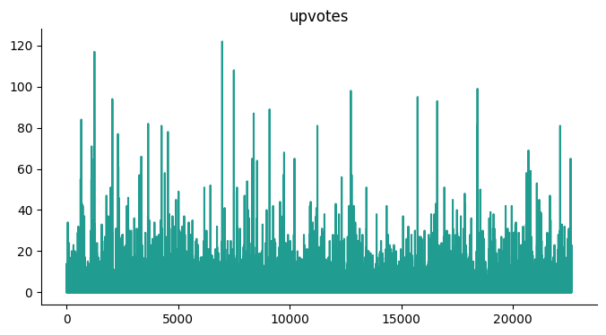
</p>

The dataset was trimmed by balancing the dataset based on the `recommended` label. And the final distribution of the upvotes was as follows having the maximum number of votes on a review to be `177` and the minimum remain `0` meaning in the dataset the review that has minimum votes has `0`.

<p align="center">
  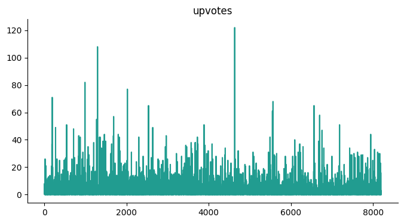
</p>

2. `rating`

Before the data was balanced with the review label. Here is how the ratings on the reviews were distributed. Most of the products that was reviewed was `5` star rated having a fraction of above `50%`. The product that wasn't having a good ratting received have a fraction of `3.6%`

<p align="center">
  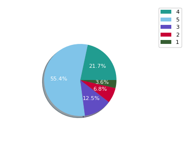
</p>

After the dataset was balanced based on the `recommended` label this is how the ratings were distributed in the entire dataset.

<p align="center">
  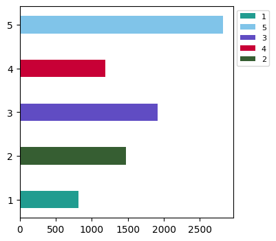
</p>

3. `recommended`

We had more products that were recommended before we balanced the dataset based on this column and this is how the recommended label was distributed in the entire dataset.

<p align="center">
  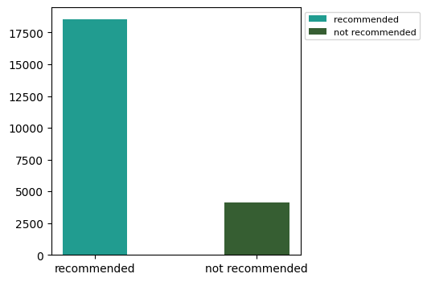
</p>

The balanced dataset had `4, 101` examples or reviews that were recommending the product and `4, 101` reviews that were not recommending the product.

<p align="center">
  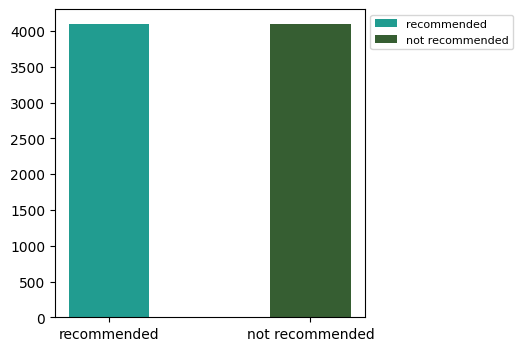
</p>

4. `text`

We wanted to check what words were appearing the most in the dataset. Before we balanced our dataset the words that were appearing the most were:

- dress
- love
- top
- fit
- look

Just to mention a few and this distribution was visualized using a `word cloud`

<p align="center">
  
</p>

After the dataset was balanced based on the `recommend` column the word cloud visualization was as follows:

<p align="center">
  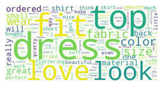
</p>
The most appearing words were:

- dress
- top
- look
- fit
- love

We concluded that the reviews were based on the women clothes, because of the words that were detected in the dataset from the text review columns.

After the dataset was balanced, The dataset was spited into `3` sets preparing for the creation of a deep learning model. These sets were:

1. `training` - The set that will be used to train the model.
2. `validation` - The set that will be used to validate the model during training and updating of model metrics during model training.
3. `testing` - The set that we will use to evaluate the model after we have trained it.

The total number of examples that we obtained after we split our dataset was as follows:

| SET              | EXAMPLES |
| ---------------- | -------- |
| **`training`**   | `5, 741` |
| **`testing`**    | `1, 230` |
| **`validation`** | `1, 231` |

### Model Metrics/Results

We created a model using `Keras Sub Classing` API for flexibility our model takes in `2` features and predict `2` labels, weather the product can be `recommended` or not which is a `binary classification` and it also classify or predict the `rating` that a product can get from a user based on the the review text and it's `upvote` count which was a multi-class classification task. The model was observed to have the following parameters

| #                              | PARAMETERS     |
| ------------------------------ | -------------- |
| **`Total Parameters`**         | `4, 571, 130 ` |
| **`Trainable Parameters`**     | `4, 571, 130`  |
| **`Non-trainable Parameters`** | `0`            |

> The model had about `4.5` total trainable parameters.

After the model was trained the training and validation metrics were stored in a history object so that they can be visualized.

The model overall `losses` for the `train` and `validation` during model training on each train epoch were as follows:

<p align="center">
  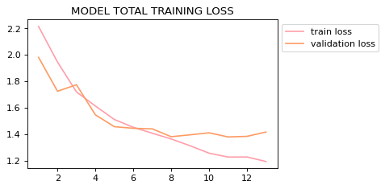
</p>

The model individual `losses` for the `train` set that were observed during model training for the `recommended` and `ratting` labels on each train epoch were as follows:

<p align="center">
  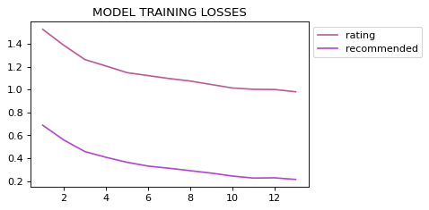
</p>

The model individual `losses` for the `validation` set that were observed during model training for the `recommended` and `ratting` labels on each train epoch were as follows:

<p align="center">
  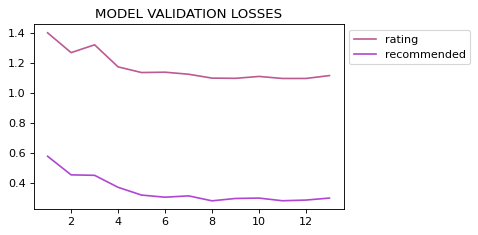
</p>

The train and validation accuracies were observed for the recommendation label per each and every epoch and were as follows:

<p align="center">
  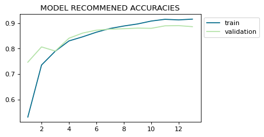
</p>

> The accuracies kept on increasing till they stopped increasing that's where we stopped training the model using a technique called `Early Stopping`. We were not interested in the `accuracies` of the `rating` label as it is not a good measure in this case because the labels were not balanced.

The model was the evaluated based on the dataset that it have never seen during training and the following metrics were observed.

| METRIC                     | VALUE  |
| -------------------------- | ------ |
| **`total loss`**           | `1.56` |
| **`rating loss`**          | `1.17` |
| **`recommended loss`**     | `0.39` |
| **`rating accuracy`**      | `0.51` |
| **`recommended accuracy`** | `0.86` |

The loss of the ratting label was higher than the one for the recommended label. This might be because the rating label was not balanced and had few examples on other labels. The overall loss of the `APR` model was quite reasonable and it can be improved in future works with a good dataset. The `rating accuracy` was just above average by `1%` this is because we had mis balanced labels on the `rating` labels, so we can't use this as a good measure on how good is our model performing. The model was having a reasonable accuracy of `~87%` which can also be improved with future works.

We went ahead to create make predictions based on the test dataset and the following confusion matrix were plotted.

<p align="center">
  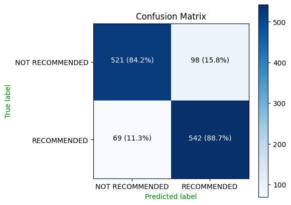
</p>

The above is the confusion matrix for the recommended label. And the model was really doing well.

<p align="center">
  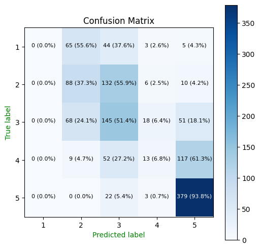
</p>

The model poorly performs on the rating labels due to the reasons that we mentioned which we can focus on on the future works. The classification report were as follows:

|                    | precision | recall | f1-score | support |
| ------------------ | --------- | ------ | -------- | ------- |
| **`0`**            | `0.88`    | `0.84` | `0.86`   | `619`   |
| **`1`**            | `0.85`    | `0.89` | `0.87`   | `611`   |
|                    |           |        |          | `-`     |
| **`accuracy`**     |           |        | `0.87`   | `1 230` |
| **`macro avg`**    | `0.86`    | `0.86` | `0.86`   | `1 230` |
| **`weighted avg`** | `0.87`    | `0.86` | `0.86`   | `1 230` |

The above is the classification report of the `recommended` label which was obtained after evaluating the model using the test data.

|                    | precision | recall | f1-score | support |
| ------------------ | --------- | ------ | -------- | ------- |
| **`0`**            | `0.00`    | `0.00` | `0.00`   | `177`   |
| **`1`**            | `0.38`    | `0.37` | `0.38`   | `236`   |
| **`2`**            | `0.37`    | `0.51` | `0.43`   | `282`   |
| **`3`**            | `0.30`    | `0.07` | `0.11`   | `191`   |
| **`4`**            | `0.60`    | `0.94` | `0.78`   | `404`   |
|                    |           |        |          | `-`     |
| **`accuracy`**     |           |        | `0.51`   | `1 230` |
| **`macro avg`**    | `0.35`    | `0.38` | `0.34`   | `1 230` |
| **`weighted avg`** | `0.43`    | `0.51` | `0.45`   | `1 230` |

### Model Inference

In this section we are going to show how you can use the `APR` server to make predictions locally.

First you are required to have `python` installed on your computer to be more specific `python` version 3 and `git`

Then you need to clone this repository by running the following command:

```shell
git clone https://github.com/CrispenGari/APR-dl.git
```

And then you navigate to the server folder of this repository by running the following command:

```shell
cd APR-dl/server
```

Next you are going to create a virtual environment `venv` by running the following command:

```shell
virtualenv venv
```

Then you need to activate the virtual environment by running the following command:

```shell
.\venv\Scripts\activate.bat
```

After activating the virtual environment you need to install the required packages by running the following command:

```shell
pip install -r requirements.txt
```

Then you are ready to start the server. To start the server you are going to run the following command:

```shell
cd api && python app.py
```

The above command will start the local server at default port of `3001` you can be able to make request to the server.

### GraphQL

With only this you will be able to test the `API` using the graphql playground that is served at the following endpoint:

```py
http://127.0.0.1:3001/graphql

# Or
http://localhost:3001/graphql
```

Open the above url in the browser and start making predictions.

### Example Prediction

In this section I will show how to make predictions to the apr-graphql-server. Note that this is an advanced way of doing it (using fragments) but if you are familiar with graphql you know the easy way of doing it. Send the following graphql request:

```
fragment ErrorFragment on Error{
  field
  message
}
fragment RatingFragment on Rating{
  rating
  probability
  stars
}
fragment RecommendFragment on Recommend{
  label
  class_
  probability
  emoji
}
fragment PredictionsFregmant on Predictions{
	recommend{
    ...RecommendFragment
  }
  rating{
    ...RatingFragment
  }
}
query APRPredictor($input: APRInput!){
  predictor(input: $input){
    error{
      ...ErrorFragment
    }
    ok
    predictions{
      ...PredictionsFregmant
    }
  }
}
```

With the following graphql variables:

```json
{
  "input": {
    "text_review": "Just piping in here ordered my usual size of small petite the slip that came with the dress is about a size negative zero it could hardly squeeze over my body and the dress itself is a bright pale aqua and it is a shift and because of the smocking it very strangely i think it very cheap and is ill fitting i would say if you are a person on which shift look awesome you might like this but mind the size of the slip in the range and also it is aqua",
    "text_review_upvote": 19
  }
}
```

You will get the similar response as follows:

```json
{
  "data": {
    "predictor": {
      "error": null,
      "ok": true,
      "predictions": {
        "rating": {
          "probability": 0.4749999940395355,
          "rating": 3,
          "stars": "⭐⭐⭐"
        },
        "recommend": {
          "class_": "NOT RECOMMENDED",
          "emoji": "👎",
          "label": 0,
          "probability": 0.769
        }
      }
    }
  }
}
```

### Model

The model that is being used here was build using tensorflow and keras `Subclassing` API and the architecture looks as follows:

```py
class APR(keras.Model):
  def __init__(self):
    super(APR, self).__init__()
    # layers for bidirectional
    forward_layer = keras.layers.GRU(
      128, return_sequences=True, dropout=.5,
      name="gru_forward_layer"
    )
    backward_layer = keras.layers.LSTM(
      128, return_sequences=True, dropout=.5,
      go_backwards=True, name="lstm_backward_layer"
    )
    self.embedding = keras.layers.Embedding(
          vocab_size, 100,
          input_length=max_words,
          weights=[embedding_matrix],
          trainable=True,
          name = "embedding_layer"
    )
    self.bidirectional = keras.layers.Bidirectional(
        forward_layer,
        backward_layer = backward_layer,
        name= "bidirectional_layer"
    )
    self.gru_layer = keras.layers.GRU(
              512, return_sequences=True,
              dropout=.5,
              name= "gru_layer"
      )
    self.lstm_layer = keras.layers.LSTM(
              512, return_sequences=True,
              dropout=.5,
              name="lstm_layer"
    )
    self.fc_1 = keras.layers.Dense(512, activation="relu", name="upvote_fc1")
    self.pooling_layer = keras.layers.GlobalAveragePooling1D(
          name="average_pooling_layer"
    )
    self.concatenate_layer = keras.layers.Concatenate(name="concatenate_layer_layer")

    self.dense_1 = keras.layers.Dense(64, activation='relu', name="dense_1")
    self.dropout_1 = keras.layers.Dropout(rate= .5, name="dropout_layer_0")
    self.dense_2 = keras.layers.Dense(512, activation='relu', name="dense_2")
    self.dropout_2 =  keras.layers.Dropout(rate= .5, name="dropout_layer_1")
    self.dense_3 = keras.layers.Dense(128, activation='relu', name="dense_3")
    self.dropout_3 = keras.layers.Dropout(rate= .5, name="dropout_layer_2")
    self.rating_output = keras.layers.Dense(5, activation='softmax', name="rating_output")
    self.recommend_output = keras.layers.Dense(1, activation='sigmoid', name="recommend_output")

  def call(self, inputs):
    text, upvote = inputs
    # Leaning the text features
    x_1 = self.embedding(text)
    x_1 = self.bidirectional(x_1)
    x_1 = self.gru_layer(x_1)
    x_1 = self.lstm_layer(x_1)
    x_1 = self.pooling_layer(x_1)

    # Learning the upvotes
    x_2 = self.fc_1(upvote)

    # concatenation
    x = self.concatenate_layer([x_1, x_2])

    # leaning combinned features
    x = self.dense_1(self.dropout_1(x))
    x = self.dense_2(self.dropout_2(x))
    x = self.dense_3(self.dropout_3(x))

    # outputs
    rating = self.rating_output(x)
    recommend = self.recommend_output(x)
    return rating, recommend
```

This models takes in two inputs which are:

```
texts: String variable for the review body.
upvotes: Positive Integer documenting the number of other customers who found this review positive.
```

And it outputs two outputs which are:

```
recommended:
    👍👎
    Binary variable stating where the customer recommends the product where 1 is recommended, 0 is not recommended.
rattings: ⭐⭐⭐⭐⭐
    Positive Ordinal Integer variable for the product score granted by the customer from 1 Worst, to 5 Best.
```

### Notebooks

There are two notebooks that were used in this project the one for data preparation and the other one for model training.

1. [Data Preparation](/notebooks/00_E_Commerce_Clothing_Reviews_Data_Prep.ipynb)
2. [Model Training](</notebooks/01_Automatic_Product_Recommender_(APR).ipynb>)
